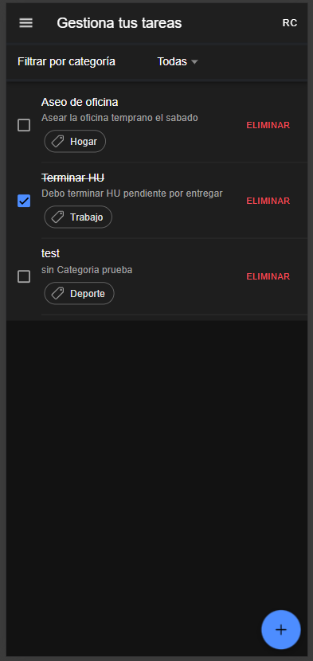
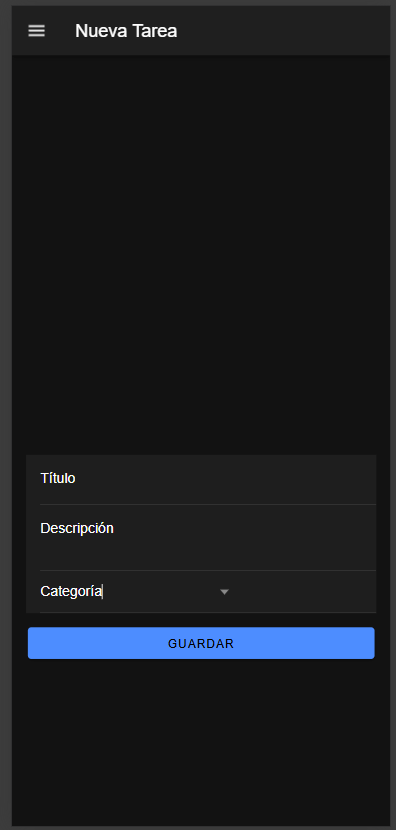
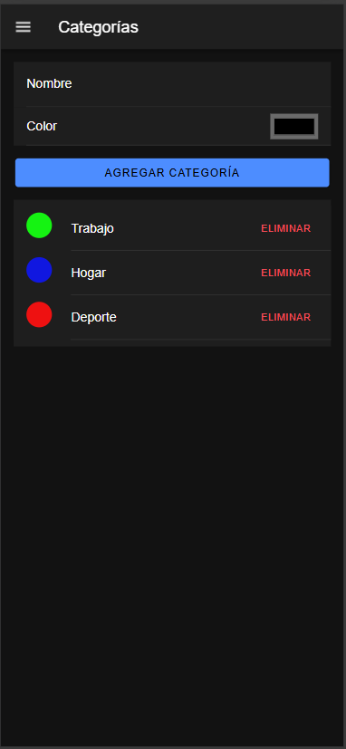
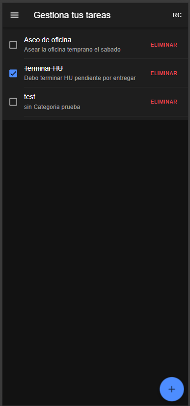

# 📱 To-Do Híbrido (Ionic + Angular + Firebase)

Aplicación móvil híbrida desarrollada en **Ionic + Angular**, que permite gestionar tareas con categorías, almacenamiento local y control de funcionalidades mediante **Firebase Remote Config**.  
Cumple con los lineamientos de la **Prueba Técnica para Desarrollador Mobile – Ionic**.

---

## 🧩 Tecnologías utilizadas

| Componente | Tecnología |
|-------------|-------------|
| Framework UI | Ionic 7 (Angular) |
| Lenguaje base | TypeScript |
| Framework JS | Angular 17 |
| Persistencia local | Ionic Storage |
| Integración móvil | Cordova |
| Feature Flags | Firebase Remote Config |
| Estilos | SCSS / Ionic Components |
| Control de versiones | Git / GitHub |

---

## ⚙️ Estructura del proyecto

```
src/
 ├── app/
 │   ├── core/
 │   │   ├── models/
 │   │   ├── services/
 │   │   └── guards/
 │   ├── pages/
 │   │   ├── home/
 │   │   ├── add-task/
 │   │   ├── edit-task/
 │   │   └── categories/
 │   ├── shared/
 │   │   └── app-header/
 │   ├── app-routing.module.ts
 │   └── app.module.ts
 ├── environments/
 │   └── environment.ts
 └── theme/
     └── variables.scss
```

---

## 🚀 Instalación y ejecución

### 1️⃣ Prerrequisitos
- Node.js (v18+)
- npm (v8+)
- Ionic CLI instalado globalmente:
  ```bash
  npm install -g @ionic/cli
  ```

### 2️⃣ Clonar el repositorio
```bash
https://github.com/duvannaranjom/seti-test-front.git
cd seti-test-front
```

### 3️⃣ Instalar dependencias
```bash
npm install
```

### 4️⃣ Configurar Firebase Remote Config
Edita `src/environments/environment.ts` con tus credenciales de Firebase:

```ts
export const environment = {
  production: false,
  firebase: {
    apiKey: "TU_API_KEY",
    authDomain: "tu-proyecto.firebaseapp.com",
    projectId: "tu-proyecto",
    storageBucket: "tu-proyecto.appspot.com",
    messagingSenderId: "XXXXXXXXXXXX",
    appId: "1:XXXXXXXXXXXX:web:XXXXXXXXXXXX",
  },
};
```

En Firebase Console → Remote Config:
```
enable_categories = true
```

---

## ▶️ Ejecución en entorno local

```bash
ionic serve
```
App disponible en: [http://localhost:8100](http://localhost:8100)

---

## 📱 Compilación con Cordova

### Android
```bash
ionic cordova platform add android
ionic cordova build android
```
APK generado en:
```
screenshots/test-seti.apk
```


### iOS (solo en macOS)
No me fue posible crearlo debido que no cuento con un equipo con iOS, ya que para su generación se debe hacer desde allí
```bash
ionic cordova platform add ios
ionic cordova build ios
```

---

## 🧠 Funcionalidades principales

- ✅ CRUD de tareas (crear, listar, editar, eliminar)
- 🏷️ Módulo de categorías
- 💾 Persistencia local (Ionic Storage)
- ⚡ Control remoto de funcionalidades (Firebase Remote Config)
- ☰ Menú lateral con navegación
- 🔄 Actualización dinámica del flag sin reiniciar

---

## 🔐 Variable de control remoto (Feature Flag)

| Clave | Tipo | Descripción | Valor por defecto |
|--------|------|--------------|-------------------|
| `enable_categories` | boolean / string | Activa o desactiva el módulo de categorías. | `true` |

---

## 📸 Evidencia visual

### Capturas de pantalla
1. **Home – listado de tareas**  
   

2. **Crear nueva tarea**  
   

3. **Gestión de categorías**  
   

4. **Feature Flag desactivado**  
   

5. **Video Funcional**  
   


---

## 🧾 Respuestas a las preguntas del reto

### 1️⃣ Principales desafíos enfrentados
- La correcta sincronización de **Firebase Remote Config** con Ionic sin necesidad de recargar la aplicación.
- Manejo del ciclo de vida y actualización dinámica del flag (`enable_categories`) en distintas vistas.
- Asegurar la persistencia local de tareas y categorías usando **Ionic Storage** con asincronía.

### 2️⃣ Técnicas de optimización aplicadas
- **Cache inteligente**: se configuró `minimumFetchIntervalMillis` en 0 durante desarrollo y con opción para configurarlo como se desee en producción.
- **Carga diferida (lazy loading)**: cada página se carga bajo demanda (`loadComponent` en routing).
- **Minimización de operaciones de I/O**: operaciones locales agrupadas en un único servicio de persistencia.
- **Reutilización de componentes**: encabezado común (`app-header`) para evitar duplicación.

### 3️⃣ Aseguramiento de calidad y mantenibilidad
- Arquitectura modular con separación en `core`, `shared` y `pages`.
- Servicios centralizados (`tasks.service`, `categories.service`, `feature-flags.service`) con responsabilidades únicas.
- Uso de **tipado estricto** (TypeScript) y modelos (`Task`, `Category`) para consistencia de datos.
- Estandarización de commits (`chore:`, `feat:`, `fix:`) y documentación detallada en README.
- Validaciones básicas y retroalimentación al usuario mediante **Ionic Toasts y Alerts**.

### 4️⃣ Archivos APK e IPA
- El APK se genera mediante:
  ```bash
  ionic cordova build android --prod
  ```
  y se incluye en la carpeta `/platforms/android/app/build/outputs/apk/release/`  
- El IPA se genera en macOS con:
  ```bash
  ionic cordova build ios --prod
  ```
  Archivos resultantes disponibles para entrega junto con el código fuente.

---

## 🛠️ Posibles mejoras futuras

- Implementar autenticación con Firebase Auth.
- Agregar pruebas unitarias y cobertura (Jest + Karma).
- Configurar CI/CD con GitHub Actions.
- Internacionalización (i18n).
- Implementar notificaciones locales y sincronización offline/online.

---

## 👨‍💻 Autor

**Duván Naranjo**  
Full-Stack Developer — Ionic · Angular · Java  

